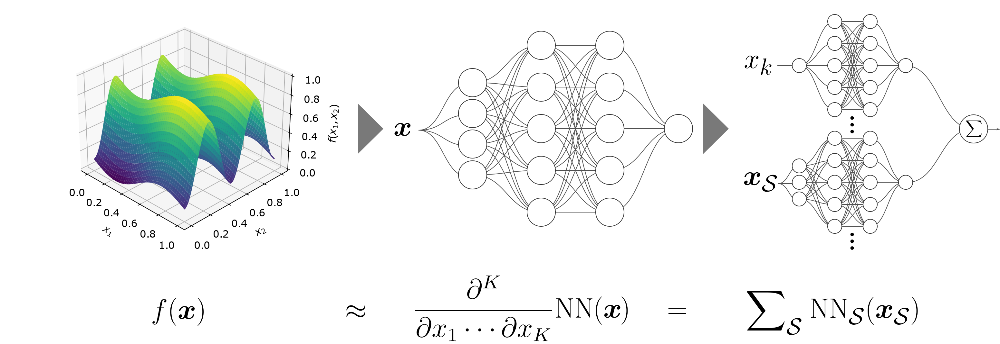
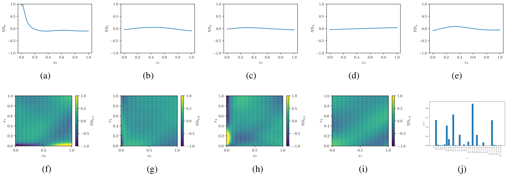

# Neural-ANOVA

## Model Decomposition for Interpretable Machine Learning

This repository contains the code to reproduce the results in the paper

@article{limmer2024neural,
  title={Neural-ANOVA: Model Decomposition for Interpretable Machine Learning},
  author={Limmer, Steffen and Udluft, Steffen and Otte, Clemens},
  journal={arXiv preprint arXiv:2408.12319},
  year={2024}
}

## Model Description

Neural-ANOVA can be used to train interpretable models that provide transparent interaction effects of all orders. Due to the construction, it is recommended to apply this model to moderate dimensions up to 10 and favorably on uniform training data. An illustration of up to second order interaction effects on the airfoil dataset is provided in the following.

A more detailed description of the algorithmic approach can be found in the accompanying paper

[Neural_ANOVA_draft.pdf](docs/Neural_ANOVA_draft.pdf)

## Prerequisites

    Optional but recommended: Docker Installed: Ensure Docker is installed on your system. You can download and install Docker from the official website.
    Python Docker Image: Ensure you have a Python Docker image available. You can pull one using the command: docker pull ghcr.io/nvidia/jax:jax-2024-04-09
	Folder Extracted: Ensure you have extracted the archive, e.g. to the folder xyz/neural-anova
	
## Instructions

	1. Start the docker container and mount the folder containing the supplementary material
		''' docker run --rm -it --gpus "all" -v $PWD/neural-anova:/input/ ghcr.io/nvidia/jax:jax-2024-04-09 /bin/bash '''
		
	2. Install the necessary dependencies using pip
		''' cd /input/ && pip install -r requirements.txt '''
		
	3. Start the a short N-ANOVA training an Ishigami data
		''' python main.py '''
	
	4. Optional: Start the training for the sensitivity analysis test functions
		''' python main.py --multirun seed=0,1,2,3,4,5,6,7,8,9 mode=anova,default num_layers=3 num_neurons=32 act_str=sigmoid l2output=0. l2input=0. max_epochs=20000 dataset_id=ishigami,circuit,piston hydra.sweep.dir=tabular_uqtest_study '''

	5. Optional: Start the training for MLP baseline for the uci data
		''' python main.py --multirun mode=default num_layers=3 num_neurons=32 act_str=sigmoid max_epochs=20000 dataset_id=165,291,294 hydra.sweep.dir=tabular_mlp_uci_study '''
		
	6. 	Optional: Start the training for N-ANOVA for the uci data
		''' python main.py --multirun mode=anova num_layers=2 num_neurons=16 act_str=rep  max_epochs=20000 l2output=1e-2 l2input=1e-5 dataset_id=165,291,294 hydra.sweep.dir=tabular_anova_uci_study '''
		
	7. 	Optional: Start the ablation study on model size
		''' python main.py --multirun seed=0,1,2,3,4,5,6,7,8,9 mode=anova,default num_layers=3 num_neurons=8,16,24,32,48 act_str=relu,sigmoid,swish,rep max_epochs=20000 dataset_id=piston hydra.sweep.dir=ablation_model_size '''
		
	8. 	Optional: Start the ablation study on noise robustness
		''' python main.py --multirun seed=0,1,2,3,4,5,6,7,8,9 mode=anova,default num_layers=3 num_neurons=32 act_str=relu,sigmoid,swish,rep noise_var=0.,1e-8,1e-7,1e-6,1e-5,1e-4,1e-3,1e-2,1e-1 max_epochs=20000 dataset_id=piston hydra.sweep.dir=ablation_training_noise '''

	9. Check the results in the generated output folders